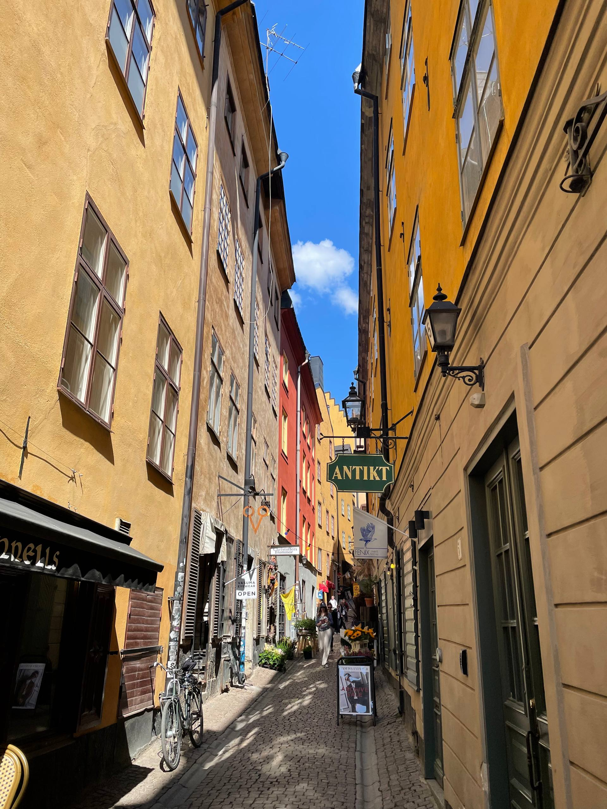
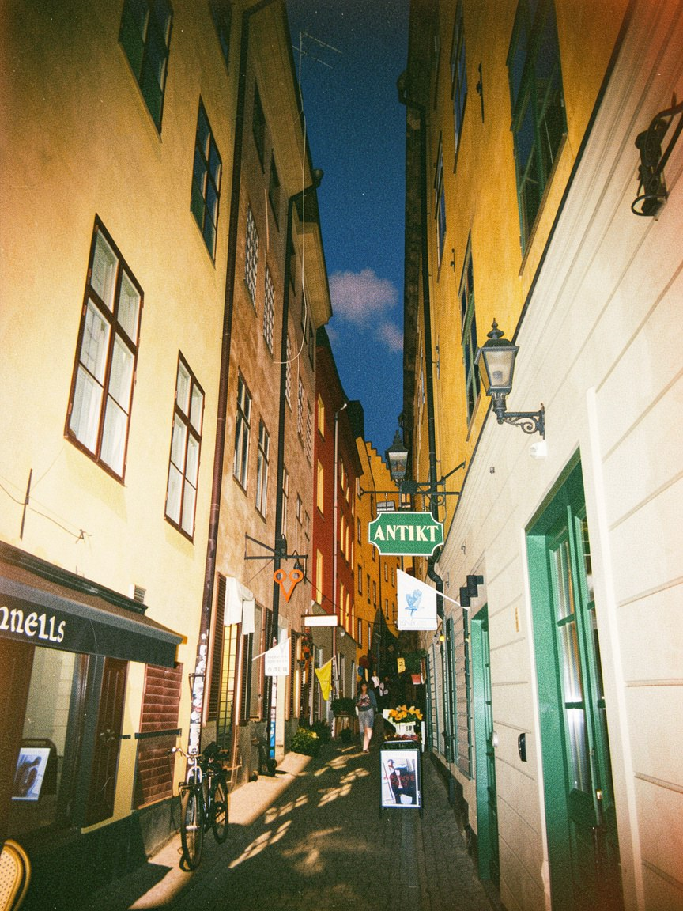
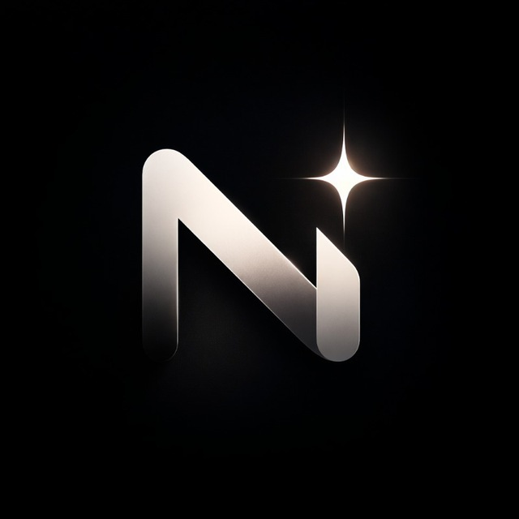

# Telegram Photo Bot MVP

Telegram bot MVP built with `Python 3.11`, `aiogram 3`, `SQLAlchemy`, Telegram Stars payments, and a pluggable image editing layer.

## Preview

<table>
  <tr>
    <th>Input</th>
    <th>Output</th>
    <th>Logo</th>
  </tr>
  <tr>
    <td></td>
    <td></td>
    <td></td>
  </tr>
</table>

t.me/NostalgiaCamBot

## What it does

- gives each new user `5` free edits;
- accepts photos in Telegram;
- lets you preview prompts for testing and debugging;
- can edit real images using `fal-ai/flux-2/klein/9b/edit`;
- stores users, image generations, payments, and request records;
- uses Telegram Stars for payments;
- works with both SQLite and PostgreSQL.

The app:

- takes an image from Telegram;
- converts it into a data URI;
- sends the request to the fal API;
- waits for the result;
- downloads the generated image;
- sends the edited image back to the user.

## Notes

- polling is used in this MVP;
- database tables are created automatically on startup;
- SQLite is good for local development;
- temporary files are removed automatically;
- by default, only `2` image generations run at the same time;
- prompt preview mode helps test prompts before real generation.
